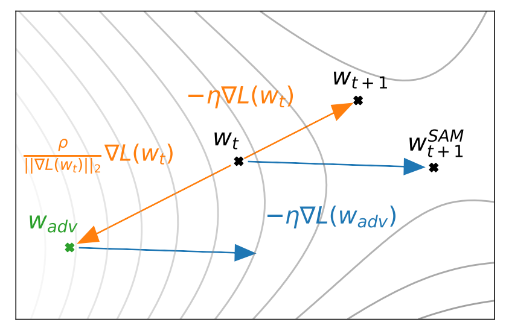

Sharpness Aware Minimization
===

The main idea behind Sharpness Aware Minimization (SAM) is to progress
in the direction informed by the worst point instead of the current one.

| |
|---|
|  |

The idea is that $w_t$ is the current location (weights of the NN) with $w_{t+1}$ would
be what was normally given by gradient descent.
Instead of choosing $w_{t+1}$, take an "advesarial" point, $w_\text{adv}$ that represents
the worst point in an epsilon ball around $w_t$, calculate the gradient from $w_\text{adv}$,
then add that to your current point $w_t$ (*not* $w_\text{adv}$).

There are surely assumptions about the shape of the landscape so that this trick of
adding the gradient direction from the worst point to the current one, but, given
some hand waivy assumptions about the energy landscape, one can see how this is
tempering eagerness of rushing towards the optimum point by considering the worst,
within a local region around the current position.

References
---

* [Hossein Mobahi: Sharpness-Aware Minimization(SAM): Current Method and Future Directions](https://www.youtube.com/watch?v=QBiLph-r5Hw)
